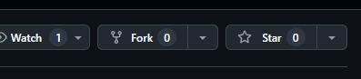
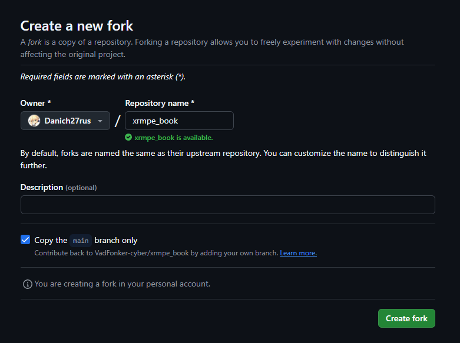
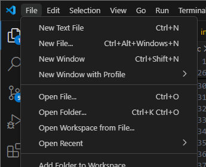
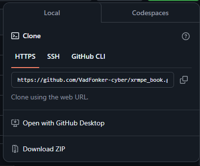
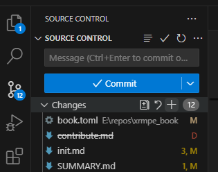
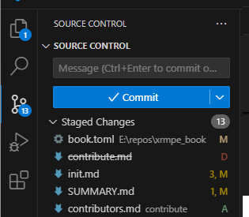

# Помощь книжке

___

## Первый способ помочь книжке

Вы можете отредактировать книжку, нажав справа по значку с ручкой.


___

## Второй способ помочь книжке

Эта книга была написана с использованием [mdBook](https://github.com/rust-lang/mdBook). Чтобы помочь книге, вам нужны следующие вещи:

1. [mdBook](https://github.com/rust-lang/mdBook)
2. [git](https://gitforwindows.org/)
3. [GitHub](https://github.com/) account
4. (Или как вариант) [VSCodium](https://vscodium.com/)

Реккомендуется использовать VSCodium или VSCode, но можно и NotePad++ или даже Блокнот.

*__Теперь нужно установить VSCode и Git__*.

## Создание форка от репозитория

Содействие по книжке производится через систему пулл реквестов ("Pull Request") workflow. Это означает, что для изменения книги, необохдимо что ваш PR одобрили мейнтейнеры репозитория.

Здесь описаны шаги для создания пулл реквеста:

1. Скопируйте (сделав "fork") репозиторий
2. Скачайте свою копию репозитория
3. Добавьте какие-либо изменения в репозиторий
4. Залейте свои правки на свой репозиторий
5. Создайте пулл реквест ("Pull request") в вашем репозитории, сделав ссылку на основной (target)

Чтож, надеюсь не сложно.

### Forking

1. Идите в [основной репозиторий](https://github.com/VadFonker-cyber/xrmpe_book)
2. Нажмите кнопку Fork

    

3. Создайте Fork проекта

    

4. У вас появилась копия проекта

#### Скачивание своего репозитория

1. Откройте/Создайте папку в VSCodium, в которую вы скачаете репозиторий.

    

2. Откройте сессию в PowerShell или GitBash
3. Скопируйте ссылку на репозиторий.

    

4. Вызовите команду на вашем компьютере, вставив ссылку вместо LINK.

    ```git
    git clone LINK
    ```

#### Запуск локальной копии

Запустите `start.bat`. Если книга не открылась сама, откройте [localhost:3000](localhost:3000) в вашем браузере.
Если вы используете любой дистрибутив Linuxa, вам нужно использовать другие бинарные файлы из [репозитория mdBook](https://github.com/rust-lang/mdBook/releases)

#### Загрузка изменений на репозиторий

1. Подготовьте систему контроля версий (Git), [гайд](https://docs.github.com/ru/get-started/getting-started-with-git/set-up-git)

2. Добавьте изменения в отслеживаемые в разделе Git VSCodium. Откройте вкладку с Gitом, наведитесь над линией "Changes" и нажмите "+".

    

3. Добавьте коментарий и нажмите "✔" чтобы зафиксировать ("commit") изменения

    

4. После этого у вас появится возможнорсть опубликовать изменения

    

## Creating Pull Request

1. In main book repository, open "Pull Requests" tab and press "New pull request"

    

2. Press "compare across forks". Choose your repository and press "Create pull request".

3. You're awesome. Probably. Now ping Igigog#6387 in Discord to get your pull request reviewed.

4. Done. Your changes are added to the main book.

___

### P.S

If you will be using VSCodium or VSCode, it is recommended to install markdown extensions to make life easier or to avoid messing up the book structure.

For example such as:

- [Markdown Link Updater](https://open-vsx.org/extension/mathiassoeholm/markdown-link-updater) - Updates Markdown links automatically, when files in the workspace are moved or renamed.
- [markdownlint](https://open-vsx.org/extension/DavidAnson/vscode-markdownlint) - This is a rule library for encouraging standards and consistency for Markdown files.
